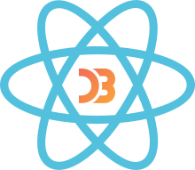
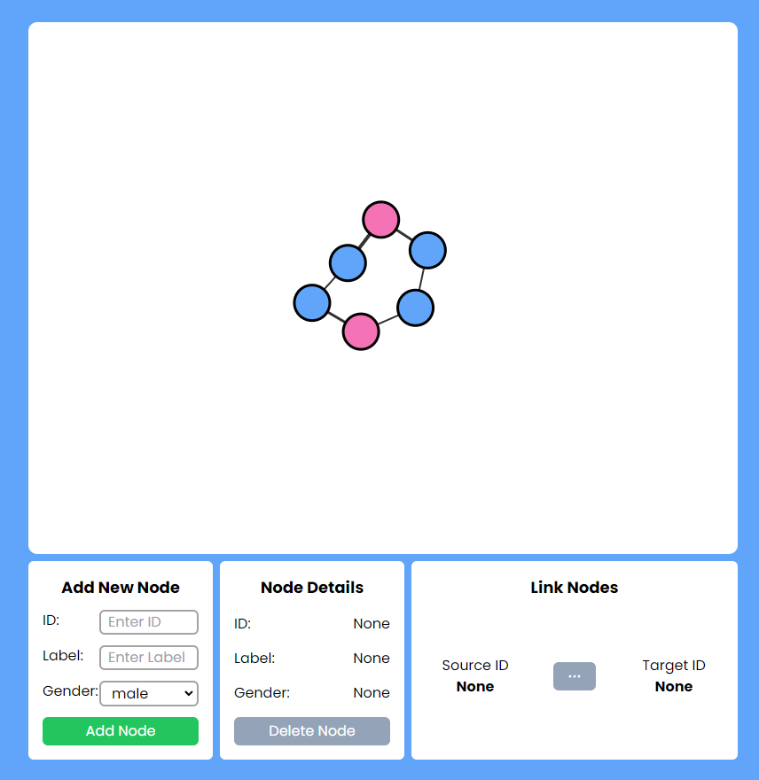
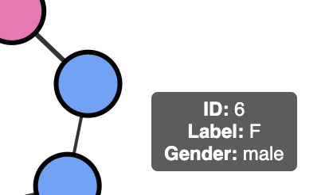
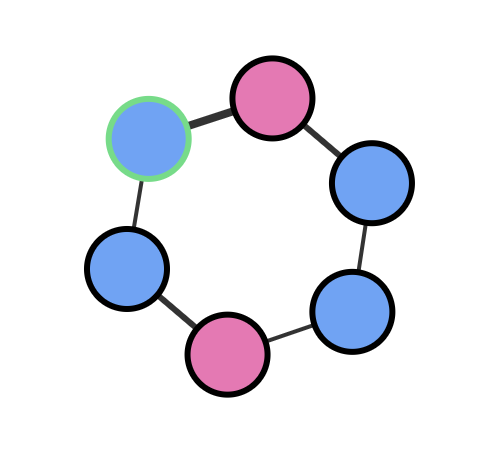
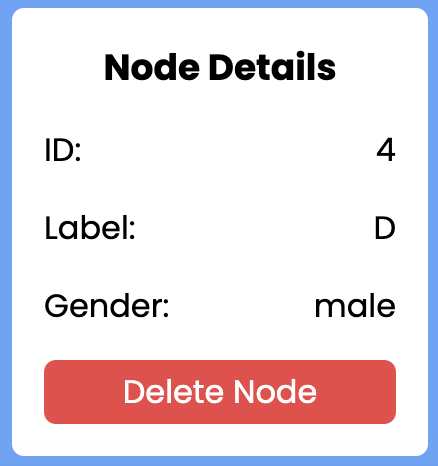
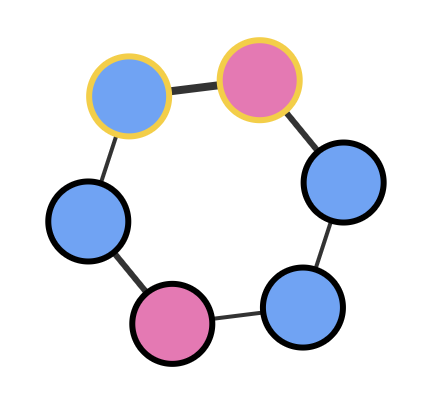
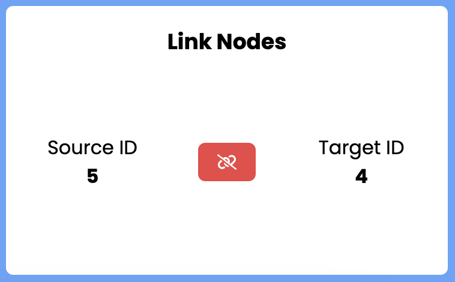

<p align="center">
    
</p>

# Force Directed Graph Challenge

---

## About

A Force Directed Graph (Network Graph) built using React + D3.js.

**Key Features**

-   **Draggable Nodes:** Easily move nodes around the interface for intuitive organization.

-   **Add New Nodes:** Dynamically create new nodes to expand your data or content.

-   **Node Tooltip:** Hover over nodes to quickly preview additional information.

-   **View Node Details:** Click on nodes to view in-depth details or information.

-   **Delete Nodes:** Remove nodes from the interface as needed.

-   **Link/Unlink Nodes:** Establish or remove connections between nodes for relationship mapping.

**Tools Involved:**

-   React.js
-   D3.js
-   Tailwind CSS
-   Vite

---

## Project Setup

Follow the following steps to get the project set up on your local machine.

1.  **Clone the repository:**

    -   Open your terminal
    -   Use the git clone command followed by the repository's URL to clone the project to your local machine.

        ```bash
        git clone https://github.com/marcus6183/d3_react_challenge.git
        ```

    -   Navigate to the project directory:

        ```bash
        cd d3_react_challenge
        ```

2.  **Install dependencies:**

    -   Use `npm` to install the project dependencies

        ```bash
        npm install
        ```

3.  **Start the development server**

    -   Use `npm` to start the development server

        ```bash
        npm run dev
        ```

4.  **View the project**

    -   Once the development server has started, you can view the project in your web browser.
    -   The default URL is: http://localhost:5173
    -   Below is a screenshot of the initial page

        

---

## Usage Guide

**Dragging Nodes:**

-   To drag a node, simply click and hold on any node to move it around.
-   Constraints are in place to ensure nodes stay within view, preventing them from going out of bounds.

**Adding a New Node:**

-   Enter a unique ID, a Label, and select a gender.
-   The ID must be unique.
-   The gender selection determines the node color (male: blue; female: pink).
-   An alert popup will appear if any of the following occur:
    -   ID is empty
    -   Duplicated ID
    -   Label is empty
-   A new node will be rendered in the view when the node is created successfully

**Show Tooltip:**

-   Hover over any node to display a tooltip showing the ID, Label, and Gender.

    

**Show Node Details and Delete a Node**

-   Click on a node to select it. The node's stroke will turn green to indicate selection.

    

-   The details of the selected node will be displayed in the "Node Details" section.

    

-   To delete the node, click the 'Delete Node' button. The node will be removed from the view.

**Link/Unlink Nodes**

-   To select nodes for linking/unlinking, hold `shift` and `click` on the nodes
-   Nodes will turn yellow to indicate a linking selection

    

-   The first node clicked will be the source, and the second node clicked will be the target.
-   Any subsequent selection of other nodes will change the target.
-   Clicking the first node again will clear the selection
-   The "Link Nodes" section will display the ID of the source (first node) and the ID of the target (second node).

    

-   If there is an existing link between the two nodes, clicking the button will unlink them. If there isn't an existing link, clicking the button will create a link between them.

---
